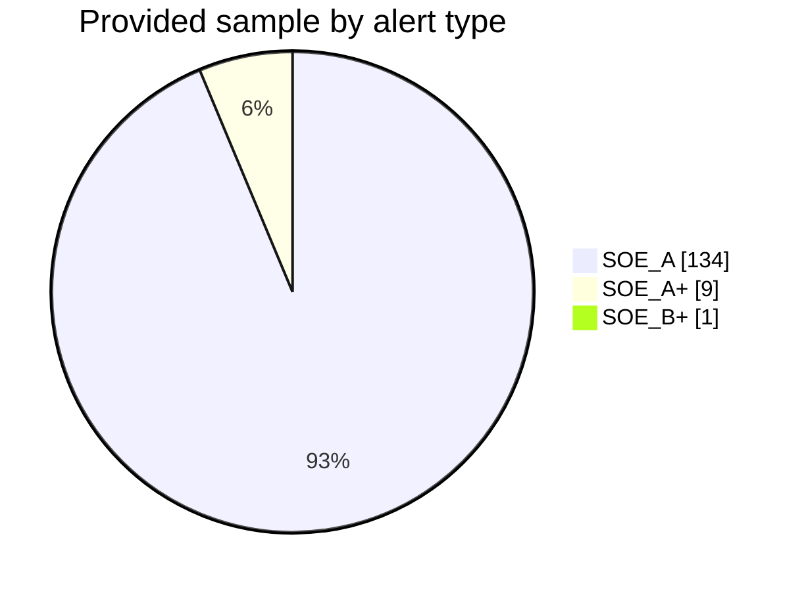
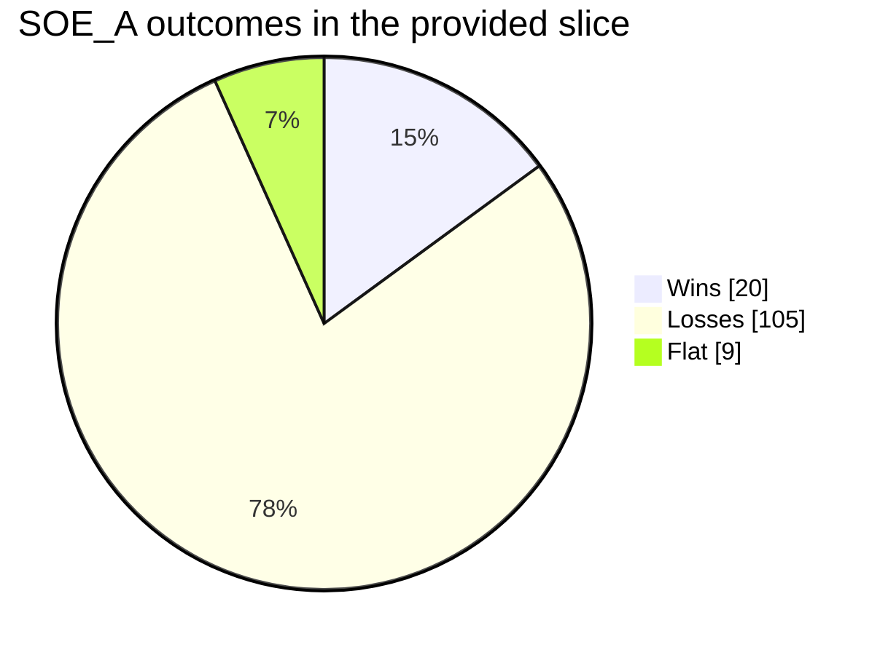
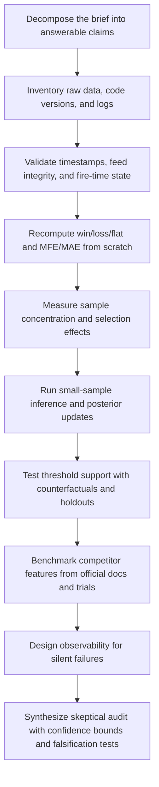
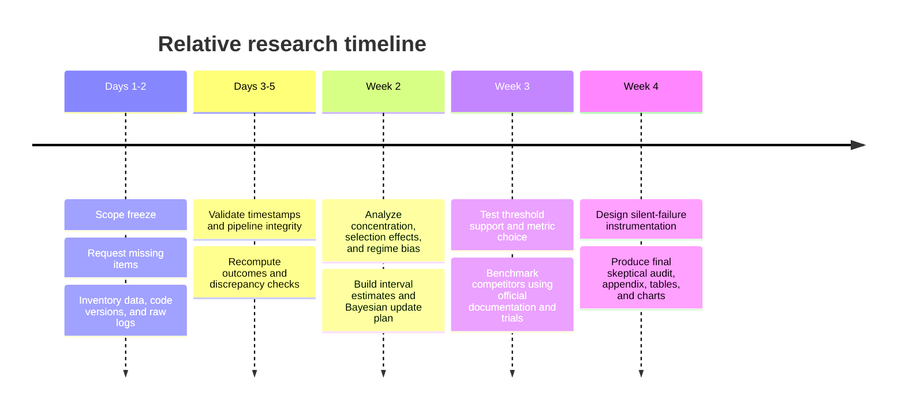

# Deep Research Brief for the GammaPulse Skeptical Audit

## Executive Summary

The pasted brief is not a generic “analyze my system” request. It is a tightly scoped red-team assignment for **GammaPulse**, a 446-ticker options-flow alert engine that consumes ThetaData OPRA tape, Tradier underlying data, Mir/Discord signals, and a gamma-exposure engine, and it explicitly asks for the holes that prior AI audits missed. The brief also defines the desired outputs with unusual precision: hidden-sample-bias analysis, Bayesian treatment of the A+ result, threshold skepticism, mundane-failure hypotheses, metric-choice critique, competitive-feature benchmarking, silent-failure instrumentation, a no-edge adversarial scenario, and a confidence-interval verdict stated as a win-rate ceiling. fileciteturn0file0

The strongest immediate conclusion is that the research engagement must start with **data integrity and identification**, not with edge claims. The evidence slice described in the document is narrow and contaminated: only **n=144** observations, overwhelmingly concentrated in **SOE_A**, collected over **May 18–19, 2026**, in a **single low-volatility regime** with **VIX 17–19**, during an **NVDA-rally-into-earnings** backdrop, and with a known stale-snapshot bug affecting part of the broader history. That means the document is asking for conclusions about system quality, threshold validity, and cross-alert performance from a sample that is both regime-thin and class-imbalanced. fileciteturn0file0

A credible response to this brief therefore needs five lanes of work in parallel: reconstruct every outcome from raw inputs; quantify concentration and selection bias; use small-sample methods that are defensible for rare-event proportions; test whether reported thresholds have any empirical support; and benchmark GammaPulse against competitors using official product documentation rather than commentary. For inference, the most defensible default tools are Wilson-style binomial intervals for raw win rates, Beta-Binomial updating for the A+ question, event-study style return windows for outcome construction, and always-valid or explicitly pre-specified sequential inference so that threshold changes are not justified by inspection of still-growing samples. citeturn6search1turn6search0turn6search11turn9search5

The brief also partially overrides the outer assumption that “no domain was specified.” The domain is clearly specified by the pasted content: it is a **real-time listed-options microstructure and product-audit problem**, with direct relevance to OPRA data handling, options order-flow interpretation, retail-options behavior, and commercial feature benchmarking in the $50–$200/month retail tooling tier. What is *not* fully specified is the final audience, deadline, the actual Gemini output, the precise definition of win/loss/flat, and the formal prior to be used for the Bayesian update. Those omissions are important enough that they should be requested explicitly before final conclusions are locked. fileciteturn0file0

The supplied sample is highly concentrated in a single alert type. Of the 144 observations described in the brief, 134 are SOE_A, 9 are SOE_A+, and 1 is SOE_B+, so about 93% of the visible sample comes from one class. fileciteturn0file0

Within the SOE_A slice itself, the document reports 20 wins, 105 losses, and 9 flats, which makes the visible outcome mix much more useful for **failure-mode investigation** than for broad generalization. fileciteturn0file0

## Parsed Requirements and Success Criteria

The brief asks for a **skeptical audit**, not a validation exercise. The research objective is to test whether the operator is missing hidden biases, overinterpreting small samples, overstating threshold rationales, optimizing the wrong metric, underestimating competitor capabilities, and failing to instrument silent breakdowns. It also asks for the final write-up to be willing to say that Perplexity was wrong about something if the evidence supports that conclusion. fileciteturn0file0

| Dimension | Extracted requirement |
|---|---|
| Core objective | Find the holes missed by prior Perplexity and Gemini reviews |
| System under review | GammaPulse options-flow alert engine with real-time tape, underlying data, Discord/Mir listener, GEX engine, and Telegram output |
| Primary question families | Sample bias, A+ small-sample interpretation, threshold arbitrariness, simplest mundane explanation, wrong metric optimization, competitor gap, silent failure mode, no-edge adversarial scenario |
| Concrete quantitative output requested | Confidence-interval verdict on a 12-month win-rate ceiling |
| Comparative output requested | Competitor audit against named products |
| Method posture | Explicitly skeptical, anti-self-deception, specific, and citation-backed |
| Prior context to incorporate | What Perplexity said, what Gemini said or is expected to say, what was shipped in response, and the first real performance slice |
| Constraints already acknowledged by user | Snapshot-bug contamination, single regime, low VIX, no earnings-day or high-VIX coverage |
| Missing but implied dependencies | Actual Gemini output, Phase 6 prior details, alert definitions, outcome-labeling rules, and raw data access |

All entries above are directly extracted from the pasted document. fileciteturn0file0

A practical way to map the document into research modules is to treat each question family as its own evidence task rather than trying to answer everything from the same backtest slice.

| Question family from the brief | Required analytic module | Minimum evidence needed |
|---|---|---|
| Hidden sample bias | Concentration and selection-bias audit | Alert-level fire log, ticker mix, DTE, time-of-day, regime labels |
| A+ 0/9 interpretation | Small-sample Bayesian and frequentist inference | Current A+ outcomes plus Phase 6 prior definition |
| Arbitrary thresholds | Threshold sensitivity and counterfactual testing | Raw factor values around every fire, not just post-threshold alerts |
| Mundane explanation | Data pipeline and label reconstruction audit | Raw tape, quote snapshots, underlying history, timestamp validation |
| Wrong metric | Expectancy / skew / risk-adjusted metric framework | Per-alert PnL path, MFE/MAE, hold-time, exit rule assumptions |
| Competitor feature gap | Official feature benchmark | Official vendor docs, trial accounts, support docs |
| Silent failure | Instrumentation review and observability design | Current logging, watchdogs, heartbeats, divergence logs |
| No-edge adversarial case | Falsification playbook | Sequential monitoring rules and holdout design |

The success criteria implied by the brief are accordingly strict: the eventual answer must be reproducible, adversarial rather than confirmatory, robust to small-sample distortions, specific about competitor tools, and grounded in academic or regulatory evidence where the document explicitly asks for it. fileciteturn0file0

## Implicit Assumptions and Open Questions

The brief is strong on the *questions* it wants answered, but weaker on the *identification assumptions* that would make those answers trustworthy. The most important unspoken assumptions are that the outcome labels are materially correct, that ThetaData and Tradier timestamps can be aligned without ambiguity, that the observed slice was not behaviorally cherry-picked, that alert definitions remained stable across the reported changes, and that a two-day low-VIX sample can say anything about a twelve-month ceiling. Academic work on retail options and options order-flow predictability makes these omissions nontrivial: retail option activity is concentrated in a small set of underlyings and short-dated contracts, while the predictive content of option flow varies materially by trade decomposition, participant class, and implied-volatility context. fileciteturn0file0 citeturn5search0turn5search8turn10search0turn10search1

| Implicit assumption | Why it is risky | What must be clarified |
|---|---|---|
| Win/loss/flat labels are correct | A labeling bug can masquerade as “no edge” or “edge decay” | Exact outcome rule, event window, exit logic, timezone handling |
| Backfill is correctly aligned | Intraday history and option-trade timestamps can drift or mismatch | Clock source, normalization logic, exchange timestamps, daylight-saving treatment |
| Provided sample is representative | A single low-VIX rally can bias type and direction performance | Full population from the same code version, including non-firing candidates if possible |
| Thresholds were not retrofitted after inspection | Post hoc thresholds create false confidence | Change log with dates, author rationale, and whether values were pre-specified |
| Alert taxonomy is stable | Renamed or filtered types can break comparability across eras | Formal versioning of the 10 alert types and filter rules |
| Phase 6 prior is well-defined | A Bayesian update is meaningless without a transparent prior | Exact n, wins/losses, and whether prior data are comparable to current codebase |
| “FlowSummit” is a known competitor | The entity could not be reliably resolved from public search alone | Exact product name and URL |
| “Win-rate ceiling in 12 months” is a defined estimand | Ceiling can mean upper credible bound, best-case regime mix, or posterior mean cap | Operational definition of “ceiling” |

The required data, resources, and expertise are also more specific than the brief makes explicit. Because the system is tied to real-time listed-options data, the research will need not only the derived SQLite outcomes database but also **immutable raw evidence** at or near fire-time: alert-state snapshots, raw option trades/quotes, underlying bars, versioned scoring inputs, and the code or pseudocode that maps these to alerts and outcomes. Official vendor and market-structure sources are available for this layer: OPRA is the consolidated options market data processor; ThetaData advertises low-latency, trade/quote, IV, and Greeks coverage; Tradier provides real-time, streaming, and historical market-data interfaces; OCC offers market-data reports including open interest and account-type volume; and Cboe sells trade-by-trade and open-close summaries with participant/action/position information. citeturn4search0turn4search8turn16search2turn16search8turn16search7turn16search1turn16search4turn8search0turn8search1turn8search3

| Required input or capability | Why it is necessary | Likely owner |
|---|---|---|
| Raw alert fire log with timestamps and scores | Core unit of analysis | System operator |
| Immutable fire-time state snapshot or hash | Needed to distinguish model failure from snapshot failure | System/operator |
| Raw option trades and quotes near each fire | Reconstruct alert causality and validate feed integrity | ThetaData / archived logs |
| Underlying intraday bars and quote history | Validate backfill and outcome labeling | Tradier / archived logs |
| Versioned rules for all 10 alert types | Needed for comparability across periods | Codebase / operator |
| Threshold-rationale log | Distinguish design intent from post hoc tuning | Operator |
| Full post-ship population, not just first 144 | Required for selection-bias and sequential-analysis control | Outcomes DB |
| Competitor documentation or trial access | Required for a verified product benchmark | Official vendor sites / trials |
| Statistical and microstructure expertise | Necessary to separate noise, flow mechanics, and pipeline artifacts | Research analyst |

## Research Plan and Methodology

The research should follow a **forensic sequence**, not a narrative one. In other words: prove the data first, then prove the labels, then test the edge claims, then critique the thresholds, then compare the product. This ordering matters because proportion estimates near 0 or 1 are fragile in small samples, naive confidence intervals are poor in exactly those settings, and continuous monitoring or threshold changes during sample growth can invalidate ordinary inference if they are not handled properly. Wilson-style interval estimation is recommended for raw proportion summaries; Beta-Binomial updating is appropriate once the prior is explicitly defined; MacKinlay-style event-study logic is appropriate for abnormal-return windows and outcome definitions; and always-valid/sequential inference methods should be adopted if the research team expects to inspect results repeatedly while data accumulate. citeturn6search1turn6search17turn6search0turn6search11turn9search5

A disciplined methodology table for this brief would look like this:

| Workstream | Preferred method | Why it fits this brief |
|---|---|---|
| Document decomposition | Question-to-evidence matrix | Prevents vague “overall impressions” and forces every requested output to have an analytic owner |
| Data-quality audit | Timestamp reconciliation, duplicate detection, gap analysis, vendor divergence checks | The brief itself raises stale snapshots and possible timing artifacts |
| Outcome reconstruction | Independent recomputation of win/loss/flat and MFE/MAE | Prevents label leakage from trusting the existing outcomes DB |
| Bias analysis | Concentration tables by ticker, time-of-day, DTE, direction, regime, and alert type | The visible sample is overwhelmingly concentrated in one alert type and one regime |
| Frequentist inference | Wilson or Jeffreys intervals for win rates | Better behaved than naive normal intervals for small or extreme proportions |
| Bayesian inference | Beta-Binomial update with transparent prior | Directly answers the A+ 0/9 question once the Phase 6 prior is specified |
| Edge characterization | Expectancy, payoff skew, drawdown-aware utility, calibration | Answers the brief’s concern that win rate may be the wrong target |
| Threshold audit | Grid search, monotonicity checks, response surfaces, and holdout validation | Distinguishes “designed threshold” from “vibes-based threshold” |
| Competitor benchmark | Official feature-page audit plus limited trial validation | Avoids relying on affiliate reviews for feature claims |
| Silent-failure review | Observability design with heartbeats, hash checks, and recomputation sentinels | The brief explicitly asks for the next silent failure mode |

The methodology should also reflect what current literature says is materially likely to matter. Trader-level research on retail options shows concentration in a small set of names and heavy use of short-dated contracts; order-flow studies show that predictive content can exist, but it depends on decomposition and context; and newer work emphasizes that not all option-market information predicts returns for the same reason. That means the audit should not stop at “flow is bullish/bearish.” It should try to observe whether performance varies by contract age, moneyness, IV regime, open-vs-close status, and—if the data can support it—participant class. citeturn5search0turn5search8turn10search0turn10search1turn10search3turn8search1

## Workplan and Schedule

A realistic research engagement for this brief is **about 52 to 76 analyst hours** if the required raw logs and code access are available at the start. If raw-state reconstruction is incomplete, the schedule expands because the work becomes partly a data-recovery assignment rather than a pure audit. The most efficient path is a staged delivery: first an integrity memo and evidence inventory, then an interim bias/inference memo, then the final skeptical audit with competitor benchmarking and instrumentation recommendations.

| Priority | Workstream | Estimated effort | Primary output |
|---|---|---:|---|
| Highest | Scope freeze and evidence map | 4–6 hours | Question-to-analysis matrix |
| Highest | Data inventory and access validation | 6–8 hours | Evidence inventory and gap log |
| Highest | Timestamp and pipeline integrity audit | 8–12 hours | Data-quality memo |
| Highest | Independent outcome reconstruction | 8–10 hours | Recomputed labels and discrepancy report |
| High | Concentration and selection-bias analysis | 6–8 hours | Bias tables and charts |
| High | Bayesian and frequentist inference | 6–10 hours | Interval and posterior memo |
| High | Metric framework and expectancy analysis | 4–6 hours | Metric-comparison memo |
| Medium | Threshold challenge and sensitivity tests | 6–10 hours | Threshold support matrix |
| Medium | Competitor benchmark from official docs/trials | 4–8 hours | Feature gap matrix |
| Medium | Silent-failure instrumentation design | 4–6 hours | Observability checklist |
| Final | Synthesis and executive report | 6–8 hours | Final audit report and appendix |

The brief does not specify a budget, so a defensible dollar estimate cannot be made yet. The direct cash costs are therefore best treated as **unspecified**. The only clearly implied external spend categories are optional competitor subscriptions or trials and, if internal data are incomplete, paid historical-data exports or market-data products. Cboe DataShop, for example, offers historical options datasets including trade-by-trade and open-close summaries, while several competitor products clearly market subscription tiers and upgrades. citeturn7search10turn8search7turn12view2turn12view1turn15search11

## Risks and Dependencies

The biggest project risk is straightforward: if the audit cannot reconstruct the **exact state of the system at fire time**, then it will struggle to separate “bad signal” from “bad measurement.” In this brief, that is more dangerous than ordinary overfitting because the user explicitly wants mundane explanations, silent failures, and threshold skepticism. A research process that skips observability and state reconstruction would undercut the brief’s whole purpose. fileciteturn0file0

| Risk or dependency | Why it matters | Likely impact if unresolved | Mitigation |
|---|---|---|---|
| No immutable fire-time state capture | Cannot prove whether a signal fired on correct context | High | Add snapshot hashes, raw-factor archives, and replayable audit rows |
| Timestamp mismatch across feeds | Can invert causality or distort MFE/MAE windows | High | Reconcile exchange timestamps, ingest time, and normalized time; run spot checks |
| Labels trusted without recomputation | Existing DB may embed the same bug as the live system | High | Build an independent outcome calculator |
| Post hoc threshold tuning during sample growth | Creates false evidence of “improvement” | High | Version thresholds and use holdout or walk-forward validation |
| Alert taxonomy drift | Breaks comparability across pre/post-ship periods | Medium | Formal alert-type versioning and changelog |
| Missing Phase 6 prior and Gemini output | Blocks the exact Bayesian and comparative tasks requested | Medium | Request both explicitly before finalizing those sections |
| Competitor access barriers | Feature benchmarking may become one-sided | Medium | Use official docs first; use trials only for verification |
| Over-reliance on win rate | Can miss positive or negative expectancy structure | Medium | Require payoff-distribution and utility metrics alongside WR |

A second, more subtle dependency is external market-structure context. OPRA is the official consolidated options feed; OCC and Cboe provide reference datasets that matter for verification; FINRA publishes delayed ATS transparency data; and SEC EDGAR provides filings needed for earnings and event context. If the audit skips those sources, it will likely over-rely on a single vendor abstraction and miss market-structure explanations for what looks like “strategy behavior.” citeturn4search0turn4search8turn8search0turn8search1turn7search0turn7search1turn7search5

## Sources and Deliverables

The correct source hierarchy for this assignment is: **internal raw evidence first, official market/regulatory sources second, original academic papers third, official competitor docs fourth, and commentary last**. Internal evidence should determine whether GammaPulse actually did what it claims. Official market and regulatory sources should be used to validate structure and enrich context. Original papers should guide methodology, especially for retail options behavior, options order imbalance, event-study framing, and sequential inference. Official competitor pages should govern feature comparisons; affiliate or review pages are acceptable only for discovery, not for asserting capabilities. citeturn4search0turn4search8turn8search0turn8search1turn7search0turn7search5turn5search0turn10search0turn10search1turn9search5

For external research, the most authoritative source set to prioritize is the following:

| Priority tier | Source or repository | Why it should be consulted |
|---|---|---|
| Highest | Internal alert logs, outcomes DB, code/version history, raw fire-time snapshots | Ground truth for whether the system behaved as designed |
| Highest | OPRA | Official consolidated quotes and last-sale options data |
| Highest | ThetaData documentation and archived outputs | Understand raw options trades, quotes, IV, Greeks, and vendor semantics |
| Highest | Tradier documentation and archived outputs | Validate underlying market-data and historical backfill behavior |
| High | OCC market-data reports | Open interest, volume, and account-type reference context |
| High | Cboe DataShop and Cboe historical-data products | Trade-by-trade data and open-close / participant-style summaries |
| High | SEC EDGAR | Earnings, 8-Ks, insider/event context, and official filing timestamps |
| High | FINRA ATS / OTC transparency data | Delayed off-exchange context for dark-pool claims |
| High | Original academic papers | Small-sample inference, retail-options behavior, options-order-flow predictability |
| Medium | Official competitor docs and support pages | Verified feature comparison for benchmark matrix |
| Low | Third-party reviews and social discussion | Discovery only, not source of record |

The official and primary sources behind that priority order are strong and complementary. OPRA defines the consolidated options market-data layer; OCC exposes volume/open-interest and account-type reports; Cboe offers historical options datasets, including open-close and trade-by-trade products; FINRA publishes delayed ATS transparency; SEC EDGAR is the official filing repository; ThetaData documents real-time and historical options trades/quotes/Greeks; and Tradier documents real-time, streaming, and historical market data. On the literature side, the most relevant primary readings are trader-level retail-options studies, options-order-imbalance papers, and methodological work on event studies, binomial interval estimation, and sequential inference. citeturn4search0turn4search8turn8search0turn8search1turn8search3turn7search0turn7search1turn7search5turn16search2turn16search8turn16search1turn16search4turn5search0turn10search0turn10search1turn6search11turn6search1turn9search5

The competitor benchmark should be built from official product materials before any interpretive commentary is added. A first-pass benchmark dimension set is already visible in those materials: Unusual Whales advertises real-time options flow, dark-pool data, custom alerts, and API access; SpotGamma advertises real-time HIRO hedging-flow analytics, API access, and a Bookmap plugin; Bookmap advertises full-depth liquidity heatmaps and replay; BlackBoxStocks advertises historical options flow, real-time net delta/gamma exposure, dark-pool data, team-trade workflows, and live rooms; OptionStrat advertises historical search, performance tracking from alert to expiry, and complex-strategy consolidation; Cheddar Flow advertises institutional dark-pool levels; Tradytics advertises options flow, darkpool tools, Discord bots, and journals; FlowAlgo advertises real-time unusual-option activity with dark-pool highlighting; and Market Chameleon publishes unusual-option-volume reporting. citeturn15search3turn15search5turn15search6turn12view0turn12view1turn12view2turn12view4turn14view0turn13view3turn12view5turn0search3

That comparison matters because some of these features are not just trader conveniences; they are **anti-self-deception tools**. For this brief, the highest-value benchmark features to test first are historical replay and immutable review context, historical search with per-alert performance tracking, complex-trade grouping, and observability around hedging-flow interpretation. Those capabilities are visible in official Bookmap, OptionStrat, SpotGamma, and BlackBoxStocks materials, and they map directly to the user’s desire to detect mundane failure, narrative drift, and false confidence. citeturn12view1turn12view4turn12view0turn12view2

The final output package to satisfy the brief should be explicit and reproducible:

| Deliverable | Recommended format | Purpose |
|---|---|---|
| Executive skeptical memo | Markdown and PDF | Concise answer to the brief’s requested outputs |
| Full audit report | Markdown/PDF with appendix | Detailed reasoning, evidence trail, assumptions, and conclusions |
| Evidence inventory and data dictionary | CSV/Markdown | Makes source-of-truth fields and schema explicit |
| Recomputed outcomes dataset | Parquet/CSV/SQLite | Independent label set for wins, losses, flats, MFE, MAE |
| Bias and concentration tables | CSV + charts | Ticker, time-of-day, regime, DTE, and alert-type concentration |
| Bayesian / interval notebook | Python or R notebook | Transparent A+ posterior and CI calculations |
| Threshold sensitivity workbook | Notebook + CSV | Holdout and counterfactual threshold results |
| Competitor feature matrix | Spreadsheet/CSV | Verified feature comparison from official materials |
| Instrumentation checklist | Markdown | Fire-time observability, alert heartbeat, replay, divergence detection |
| Open-issues log | Markdown/CSV | Tracks unresolved assumptions and blockers |

The brief also explicitly requires missing information to be requested from the user. The following items are presently unspecified or incomplete and should be confirmed before a final skeptical audit is considered complete:

| Missing item to request | Why it is needed |
|---|---|
| Actual Gemini output | The document says it will be pasted later, so comparison is incomplete without it |
| Phase 6 prior details | Required for a legitimate Bayesian A+ update |
| Formal definition of win, loss, and flat | Core outcome metric is otherwise ambiguous |
| Formal MFE/MAE formula and event window | Needed to audit expectancy and path-dependent performance |
| Exact definitions of all 10 alert types | Needed for cross-type comparability |
| Threshold values and contemporaneous rationale for each shipped filter | Needed to distinguish empirical support from intuition |
| Raw fire-time snapshots or replayable alert-state rows | Needed to investigate silent pipeline failure and snapshot issues |
| Full post-ship population, not just first 144 | Needed to test selection effects and sequential inference |
| Audience and intended use of the final report | Determines tone: internal engineering red-team vs operator guidance |
| Definition of “12-month win-rate ceiling” | Needed so the confidence-interval verdict targets the right quantity |
| Exact identity and URL of “FlowSummit” | Public search did not reliably resolve this competitor |
| Deadline and budget constraints | Needed for scoping depth and optional paid-source procurement |

The brief is already strong enough to support a rigorous research engagement. Its main weakness is not lack of skepticism, but lack of finalized **measurement definitions**. The highest-leverage move is therefore to turn the pasted brief into a reproducible audit protocol: freeze definitions, reconstruct raw truth, and let the conclusions come last. fileciteturn0file0