# SUNDAY SCANS

*May th, 2026*

**Source:** https://unchartedterritoryy.substack.com/p/sunday-scans-68a
**Published:** unknown
**Author:** Uncharted Territory
**Fetched:** 2026-05-10T23:18:22.444024

---
**First off! HAPPY MOTHER’S DAY!**   
  
We are excited to welcome you back to another exceptional edition of SUNDAY SCANS for you today. Take your time to work through each of the sections in this newsletter to prepare yourself for the action packed week ahead.  
  
We take 8-10 hours throughout the weekend to compile this information, analyze it, and type up our thoughts in order to make your weekend prep easier.

---

## **WHAT WE WILL COVER TODAY**

---

***-Intro/Thoughts/Lesson  
-Giveaway 1 Free Year to the Discord  
-Schedule of economic data and earnings  
-Market Breadth Data & Internals  
-Index and ETF Analysis  
-Bracco’s Breakdown and Top Ideas + Month End Review  
-TSDR Weekly Outlook and Watchlist  
-Broader Watchlist to Scan & Monitor  
-Will send video breakdown for Discord Members.***

FREE UNCHARTED NEWSLETTER!

Subscribe

---

### **ALL Uncharted Territory Members will get One FREE month of Deepvue Access!**

---

**For the price of Uncharted Territory Discord access you now get**  
  
-1 Free Month of Deepvue  
-Discord Access  
-Live Trading  
-Active and Dedicated mentorship, TRULY  
-Active Trade Ideas, Performance, and Alerts  
-Trader Channels from TSDR, Bracco, ChartMaster, Manrav, AJIA, Jersace  
-Active and Helpful Community of skilled traders  
-Library of recorded educational lessons on foundations of trading skill on every topic  
-Library of Setup examples

[Discord Access](https://whop.com/uncharted/uncharted)

---

# **SUNDAY SCANS, Let’s get into the action!**

---

***EDIT: Decided to run it for one last day. At Midnight tonight the code SUBSTACK will be inactive.***THIS IS THE LAST WEEK THAT WE WILL BE RUNNING THE SUBSTACK DISOUNT CODE FOR ACCESS TO THE DISCORD!  
  
Next week the code will be removed and only full price access will be allowed. Take advantage of the discount 15% off every payment forever until cancelled or you become such a damn skilled trader you don’t need the group! But guess what, you’ll want to stay.  
 **[Go to our website and use code “SUBSTACK” for 15% off forever!](http://whop.com/uncharted)**

[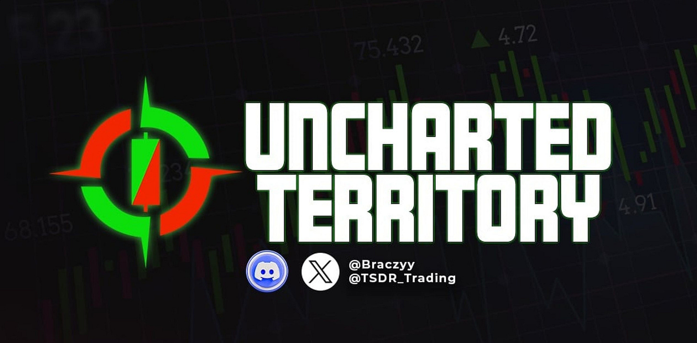](http://whop.com/uncharted/uncharted)

---

#### **INTRO**

---

It’s not just this period. This absolutely historic and remarkable period in the market. But all of them that I have experienced. All the lessons, hardships, and successes. Combined this with all the knowledge that is learned from those that have gone before and experienced the same ups and downs. That has brough us here and taught us the principles of trading for a lifetime. And they can be broken down into three simple truths.   
  
-Respect the price action of the market  
-Ride your winners  
-Cut your losses  
  
*Aggregated by George Coyle, Author of the Market Wizards book set to come out in June of this year.*   
  
Within them are massive intricacies, adaptations, and self discoveries only forged by living through the hell fire of the market for a few dozen or more cycles. I can teach you my lessons with the hopes that you will learn easier or softer. I can show my entries and ideas with the hopes that you will execute effectively as I know I will. But only you can develop the scar tissue necessary to make it through the trials and tribulations that accompany a trader’s journey.

---

Today, I would like to share a few of those. Some of which might be unpopular, or completely unrelatable for many of you. For some, it might be just what you need to hear.   
  
Cut your losses. Are we talking LOD, previous day’s low, 8% stop, 2% stop? Well, yes. All of that works, if you let it work. If you stick to it. If you allow it to. Chances are, most of your challenges come from meddling, or involving yourself when really you can let your stop be the stop and if it stops you out then you sell. So whether it’s LOD or an arbitrary 3% stop, yes.   
  
Now, many probably are thinking what about moving my stop once a trade starts to work. Yeah there is some nuance. But is there? What if you make it so there isn’t. What if you said when I get up 2R, or up 10%, or up 20% then I can move my stop to breakeven. What if there was something in place instead of “oh I didn’t have cushion to take on “overnight risk”. Which while we here, if anyone says overnight risk as a phrase block them and show them this chart.   
  
*Insert SPX overnight performance chart.*

[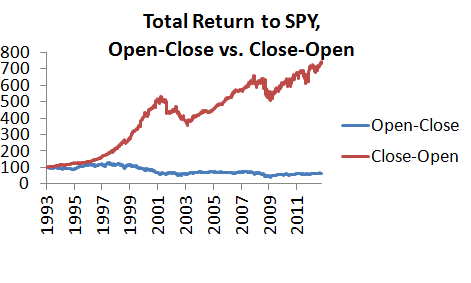](https://substackcdn.com/image/fetch/$s_!V6vs!,f_auto,q_auto:good,fl_progressive:steep/https%3A%2F%2Fsubstack-post-media.s3.amazonaws.com%2Fpublic%2Fimages%2Fc03388c8-8776-4883-b4be-843879d79c3a_471x283.png)

Okay back on topic. Point of it is defining where is my stop. And letting it be! I enter on the daily chart or the hourly chart. What good will a five minute upper wick do for me? Wouldn’t I be better off placing a hard stop order in my broker and then go over to my journal and playbook the trade process and plan? I’ll bet my ass and a half that almost all of us would be better off doing that. Even something like I keep my stop my stop until the 20EMA comes above my entry, then I will move my stop to breakeven and trail the 20EMA close. Then when the 50SMA crosses above my entry I will trail the 50SMA. Of course, you have to balance that out with the math of withstanding a drawdown to that spot. And in that case you should trim to be able to trail that planned stop.   
  
Anyways, point of it is, have a criteria. Write it down. And do it. I want to read this quote from Christian Flanders that he posted on Friday.

[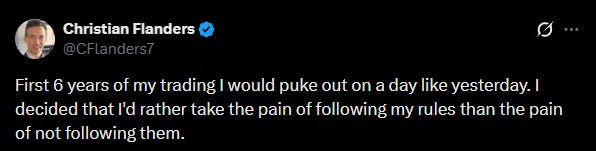](https://substackcdn.com/image/fetch/$s_!pR55!,f_auto,q_auto:good,fl_progressive:steep/https%3A%2F%2Fsubstack-post-media.s3.amazonaws.com%2Fpublic%2Fimages%2Fdcb0540d-032d-4af9-8e4d-857bed5d0fec_596x151.png)

I decided I’d rather take the pain of following my rules than the pain of not following them. What a perfect phrase to motivate you to accept the uncertain outcome of the trade.

---

Ride your winners. Okay yeah, but how. Sure it would be great to buy SNDK at $60 over IPO highs and trail a 50SMA all the way to $1500. Yes, it would! But could you? Do your thoughts and actions even allow for that to occur? Do you have guardrails in place to allow for these outliers. Or are you trimming your NVDA at $540 on Jan 9th, 2024 to lock some in. Not all will be SNDK, NVDA, or anything of the sort. Most will be forgettable small wins. Or small losses. But you should have something in place to allow for outliers to greatly benefit your account. And of course, accept the circumstances that come with that. Such as drawdown to the 9ema, 20ema, 50sma, previous support level.   
  
For me, I like to simply do the math. If I were to trail all my positions with a 20EMA stop would the drawdown be too much to handle. Does the circumstances of the market backdrop encourage me to allow for that drawdown to potentially occur. Meaning, are we in a historically hot fucking period where semis are literally doubling and tripling in days and weeks?!?!? YES lol what. So why wouldn’t I accept a measly 9EMA trail on MU while I am up 75%. Why wouldn’t I accept a drawdown on ARM when I am up 95% and it can barely stay red for a session. Sure I see the extension, so does everyone. But this is obviously special and every period won’t be. If the math doesn’t fit within that defined framework then I will sell a portion to allow for me to mange the trade within that framework, again, accepting the uncertain outcome just as I do with my stops. Knowing where but not when I will be exiting, and not knowing what will happen in between.

---

Respect the price action of the market. What a powerful statement. Takes a bit of ego to not do so right? Everyone is wrong but me. I know something everyone does not. I see something that most are oblivious to.   
  
Or, respect the price action of the market. Could be trade with the trend for trend following traders, historically the most successful and broad group of market participants. Either way it means allow the market to validate or invalidate and you are just there to execute within that structure of the multi Trillion Dollar marketplace we have here in the US.   
  
It could also mean truly internalizing that the market is a discounting mechanism and often prices in forward looking events or circumstances before it reaches the masses. This speaks to something I find to be critical as a trader. TRUST. Trust the market, trust the price action. Have a healthy relationship with the market and your “read”. Those that look on with skepticism, doubt, and disbelief are often mirroring their own true internals onto the market. Those than can trust and believe with confidence in themselves and the market will undoubtedly see more success.

---

In conclusion, I encourage you to do a few things after this cycle concludes and when the market goes into hard mode again. Write down your goals, your principles, your objectives. Write down your strategy. Write down your rules within that strategy. Write down what encourages participation and what means it’s simply time to watch. Give yourself a framework to navigate within otherwise you will continue to get in the way of the potential that the market has to offer.   
  
Let’s have a great week folks!

---

# **SUNDAY SCANS, Let’s get into the action!**

---

#### **GIVEAWAY**

---

#### **IT IS BACK! Fell short by a few Restacks. So doing it again this week! Looking forward to giving out a free 1 year again this week! Restack, Like, Comment to help reach more traders and earn a free 1 year to the discord! WE WANT TO GIVE A FREE YEAR TO SOMEONE!**

---

ONLY IF this post gets 60 *Restacks & 60 Likes* then we will giveaway One Annual Membership access to the Live Trading Discord Server.

[Leave a comment](https://unchartedterritoryy.substack.com/p/sunday-scans-4d1/comments)

[Share](https://unchartedterritoryy.substack.com/p/sunday-scans-4d1?utm_source=substack&utm_medium=email&utm_content=share&action=share&token=eyJ1c2VyX2lkIjoyNTg4MTE0MjcsInBvc3RfaWQiOjE3MjE0Mjc1NywiaWF0IjoxNzU3MTgwNjMxLCJleHAiOjE3NTk3NzI2MzEsImlzcyI6InB1Yi01MjAyOTgwIiwic3ViIjoicG9zdC1yZWFjdGlvbiJ9.BcDSaNAdrXlO7gS6yGmtRRGzL9i8nn7J-Tzy8n_M1dw)

---

### **Earnings & Economic Calendar for the Week**

---

Another wave of awesome earnings.

[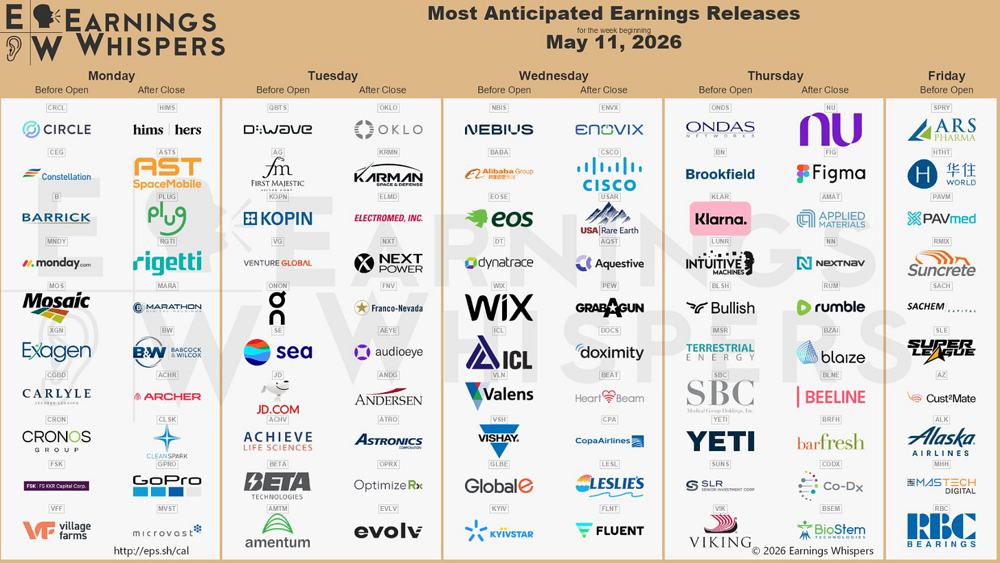](https://substackcdn.com/image/fetch/$s_!dbB3!,f_auto,q_auto:good,fl_progressive:steep/https%3A%2F%2Fsubstack-post-media.s3.amazonaws.com%2Fpublic%2Fimages%2Fdd65b97d-b292-46a4-bf23-d95d3a411e1d_1669x940.png)

---

CPI Tuesday.

[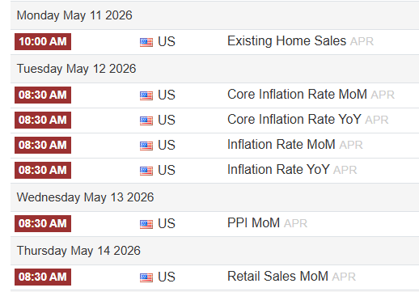](https://substackcdn.com/image/fetch/$s_!nda8!,f_auto,q_auto:good,fl_progressive:steep/https%3A%2F%2Fsubstack-post-media.s3.amazonaws.com%2Fpublic%2Fimages%2F5e125100-1988-4f7b-a272-c6d4d44138e1_518x361.png)

---

## **Market Breadth Data**

---

**StockBee (Pradeep Bonde) Market Monitor**

[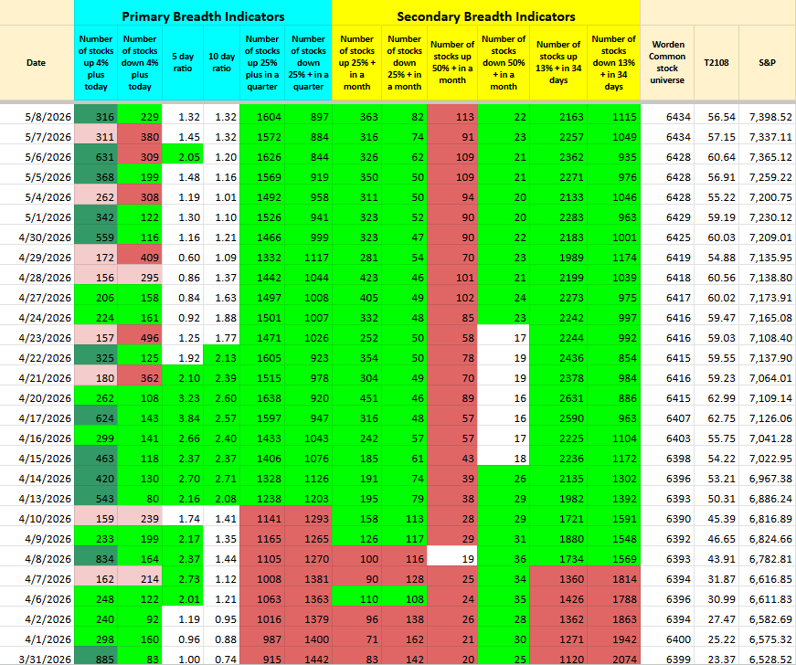](https://substackcdn.com/image/fetch/$s_!tL7t!,f_auto,q_auto:good,fl_progressive:steep/https%3A%2F%2Fsubstack-post-media.s3.amazonaws.com%2Fpublic%2Fimages%2Fc158a499-165f-4f71-a315-034275040e0d_871x728.png)

---

**UCT Breadth Monitor as well. Will give more detail in the future.**

[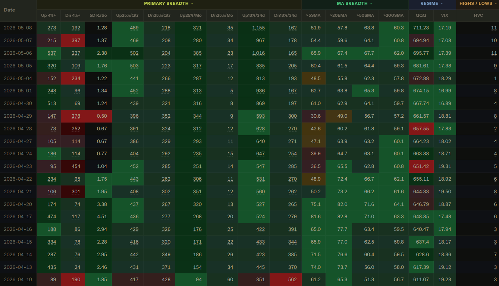](https://substackcdn.com/image/fetch/$s_!lW8R!,f_auto,q_auto:good,fl_progressive:steep/https%3A%2F%2Fsubstack-post-media.s3.amazonaws.com%2Fpublic%2Fimages%2F9e359b4c-8f34-427a-a413-e8481850d798_1338x768.png)

---

**Bracco’s Market Health Tracker**

[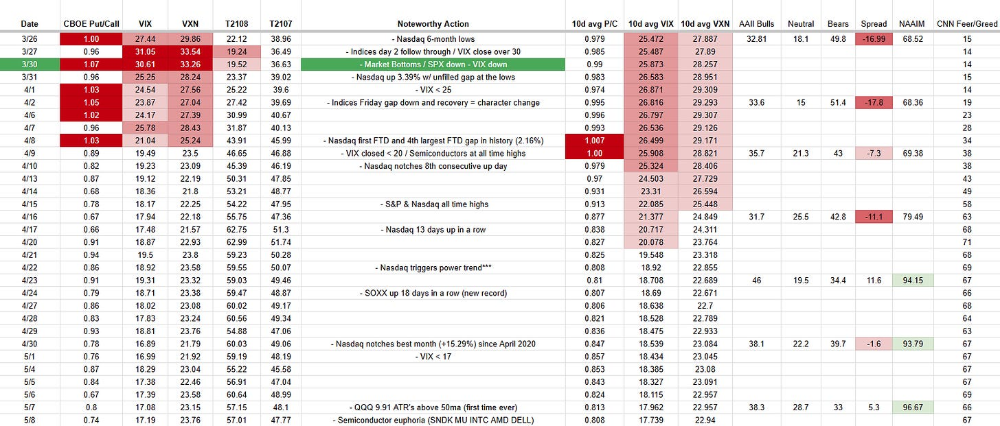](https://substackcdn.com/image/fetch/$s_!RVDt!,f_auto,q_auto:good,fl_progressive:steep/https%3A%2F%2Fsubstack-post-media.s3.amazonaws.com%2Fpublic%2Fimages%2Ff5ad8b25-6f11-4481-b717-2aa8c373acd1_1651x704.png)

---

**Theme Tracker From Deepvue (1W, 1M, YTD)**

[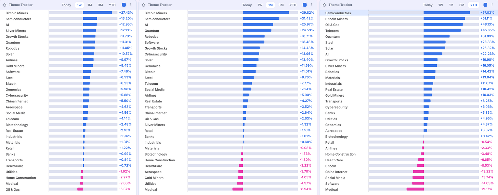](https://substackcdn.com/image/fetch/$s_!edw6!,f_auto,q_auto:good,fl_progressive:steep/https%3A%2F%2Fsubstack-post-media.s3.amazonaws.com%2Fpublic%2Fimages%2F73333008-c625-4c75-a8a0-522270d8060c_1853x729.png)

---

**S5FD (% of Stocks Above 5MA) = 42.64%**

[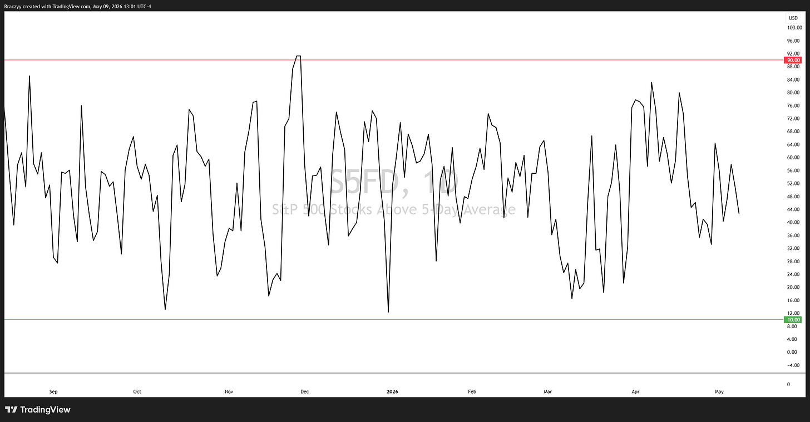](https://substackcdn.com/image/fetch/$s_!OdOL!,f_auto,q_auto:good,fl_progressive:steep/https%3A%2F%2Fsubstack-post-media.s3.amazonaws.com%2Fpublic%2Fimages%2F16449f6d-b66a-4488-987a-234d3a4c124f_2454x1281.png)

---

**T2108 (% Stocks Above 40MA) = 57.01%**

[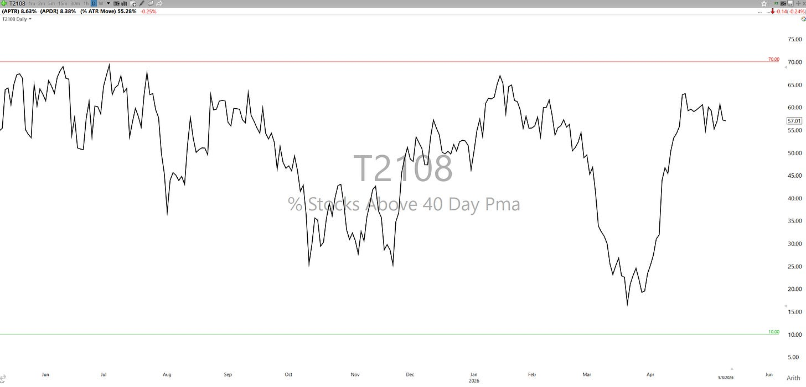](https://substackcdn.com/image/fetch/$s_!3mO-!,f_auto,q_auto:good,fl_progressive:steep/https%3A%2F%2Fsubstack-post-media.s3.amazonaws.com%2Fpublic%2Fimages%2Fe240659a-2aa9-4391-b919-2f30c58feed9_2551x1229.png)

---

**T2107 (% Stocks Above 200MA) = 47.77%**

[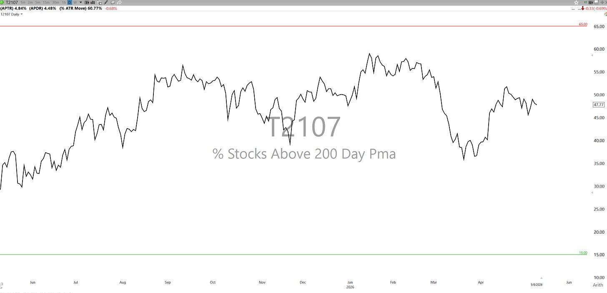](https://substackcdn.com/image/fetch/$s_!16he!,f_auto,q_auto:good,fl_progressive:steep/https%3A%2F%2Fsubstack-post-media.s3.amazonaws.com%2Fpublic%2Fimages%2F5f48b6d2-0c9f-4e7a-8b65-4c94ea741f56_2542x1233.png)

---

**Seasonality**Slowdown expected here based on 20 year lookback of SPX seasonality.

---

## **Index & ETFs**

---

##### **ETFs Covered QQQ SPY IWM SMH MAGS XLK RSP XBI ARKK COPX REMX WGMI USO UFO HACK IGV**

---

**QQQ (Daily)**Another just remarkable week for the market. What goes high can certainly go higher. We are quite literally in Uncharted Territory right now. Whether gauging the performance or the extension we are truly witnessing history. We will dive into a number of other charts down below but this is why the Nasdaq is the main one we focus on. It is the main gauge for opportunity in the most tradable stocks. This is why you do not fight the trend and “extended” is not a setup. There are 10 unfilled bull gaps. That is strength!   
  
I expect pullback and quite frankly it has been hard to justify new positions given the historic readings on the market. Especially toward the end of this past week. However, how can you say no to something setting up and offering an attractive risk to reward spot? I lean heavily towards patience in the coming weeks. But I remain willing until evidence is given! And I am certainly mindful that it can come quickly.   
  
Whether it is a pull to the 9ema, the 20ema, or just sideways digestion while individual stocks continue to stand out. The time to press risk was over the past few weeks. While we held lows, remounted MAs, when leaders stood out with RS. There can be and there will still be opportunity so continue to stay in tune and ready for when it becomes viable for confident new positions.

[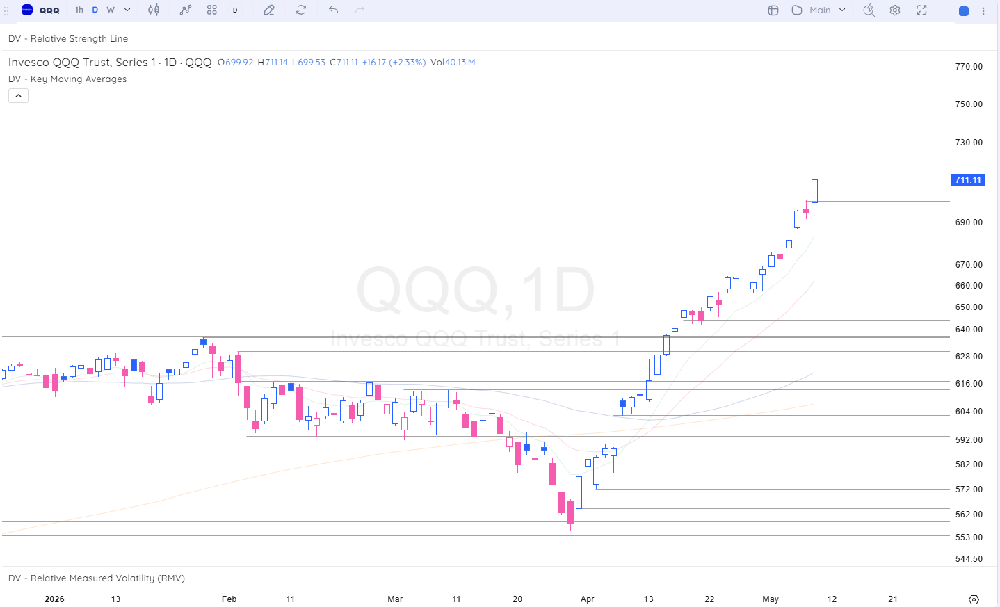](https://substackcdn.com/image/fetch/$s_!kotW!,f_auto,q_auto:good,fl_progressive:steep/https%3A%2F%2Fsubstack-post-media.s3.amazonaws.com%2Fpublic%2Fimages%2F9ee31a95-7002-454d-a226-31b82f5629a1_1438x873.png)

**SPY (Daily)**Similar thoughts as QQQ of course. I want to watch how the market reacts at gap supports. When you look at SPY you can see we did base and consolidate around the $700-$710 level for about 8 sessions. So technically we are in a 6 day burst from there. Not as insane when you look here. Still remarkable.   
  
Want to mention that I trade stocks best when I am focused on just that, stocks. The indexes often are lagging or not showing the complete picture of what the opportunity set truly is. In fact, I think most traders would do better if they didn’t even track the indexes as long as we are above the 20EMA.

[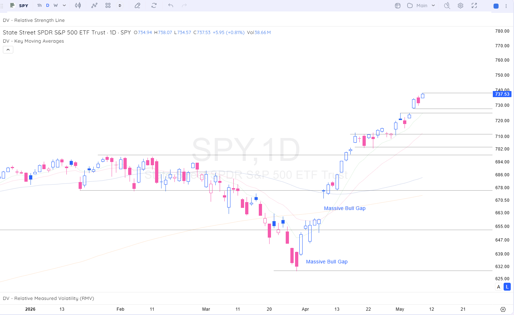](https://substackcdn.com/image/fetch/$s_!oC5l!,f_auto,q_auto:good,fl_progressive:steep/https%3A%2F%2Fsubstack-post-media.s3.amazonaws.com%2Fpublic%2Fimages%2Ff4cd0cad-6f7c-4e0b-a2a7-e5889809e734_1432x879.png)

**IWM (Daily)**Another visual to show that most stocks are actually tighter than the Nasdaq shows. $280 to $277 good support area. and $288 the level above to clear.

[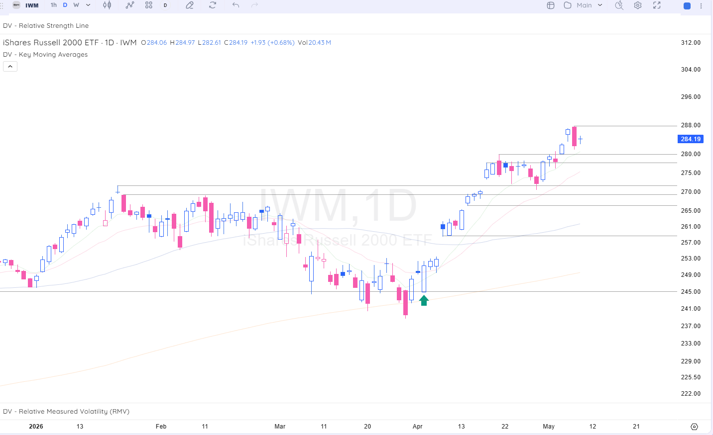](https://substackcdn.com/image/fetch/$s_!W-Ve!,f_auto,q_auto:good,fl_progressive:steep/https%3A%2F%2Fsubstack-post-media.s3.amazonaws.com%2Fpublic%2Fimages%2Ffc9889e5-2271-4298-a86e-bf4cf0226105_1432x875.png)

**SMH (Daily)**If it ain’t a semi I don’t want it. Either we are headed for a blow off or we will base and base SOON.

[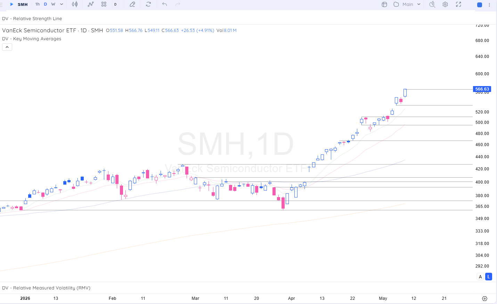](https://substackcdn.com/image/fetch/$s_!nCu5!,f_auto,q_auto:good,fl_progressive:steep/https%3A%2F%2Fsubstack-post-media.s3.amazonaws.com%2Fpublic%2Fimages%2Fd007f5b5-0f94-4636-9788-1a8ea0dda945_1430x876.png)

**MAGS (Daily)**All time highs. I encourage folks to go read the Sunday Scans from 3/30 where we called out the upside opportunity. Obviously had no idea the speed and magnitude of the move, but the entry opportunity was there. Literally at the lows too. However, you didn’t need to do that either. If you followed exposure and participation rules you should have multiple comfortable positions and trailing properly.

[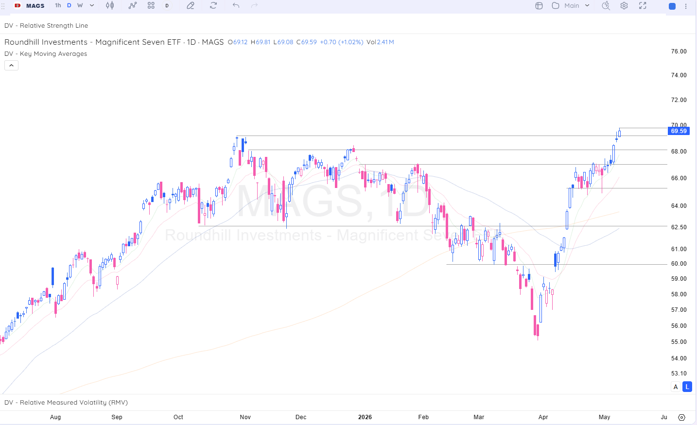](https://substackcdn.com/image/fetch/$s_!gzqM!,f_auto,q_auto:good,fl_progressive:steep/https%3A%2F%2Fsubstack-post-media.s3.amazonaws.com%2Fpublic%2Fimages%2F7034e11b-c556-47ff-88fd-8db49254744d_1434x875.png)

**XLK (Daily)**I believe this is the most “extended” the tech sector has ever been. Ever. We are due for multiple multiple weeks of basing. Can the market play hot potato and rotation and pass it off to keep the party rolling?

[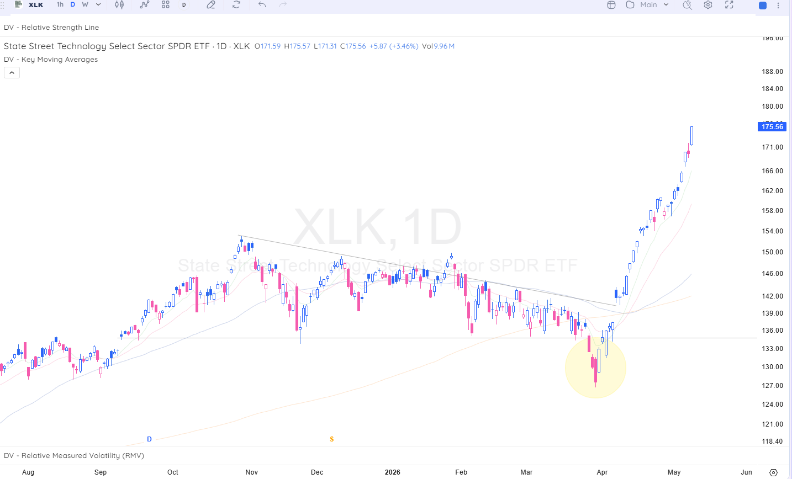](https://substackcdn.com/image/fetch/$s_!urPq!,f_auto,q_auto:good,fl_progressive:steep/https%3A%2F%2Fsubstack-post-media.s3.amazonaws.com%2Fpublic%2Fimages%2Fe2ac194a-7ed0-4b6b-b3f9-2eb887c5bdd5_1434x868.png)

**RSP (Daily)**Equal weight of the S&P. This means each of the 500 stocks is weighted at 0.2% weight instead of heavy tech like it is distributed in the actual index. Shows how concentrated it has been especially the past 2-3 weeks.

[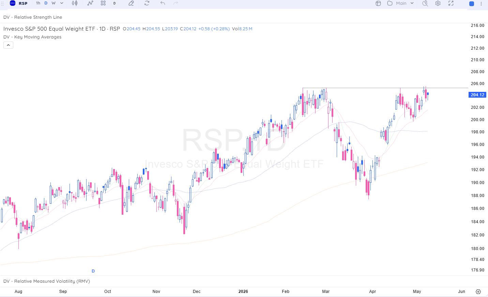](https://substackcdn.com/image/fetch/$s_!03sy!,f_auto,q_auto:good,fl_progressive:steep/https%3A%2F%2Fsubstack-post-media.s3.amazonaws.com%2Fpublic%2Fimages%2F6d48bf73-fc83-4f5a-8702-9958ca412949_1432x873.png)

**XBI (Daily)**Still very interested in the biotech sector. Not on an individual stock basis though. XBI or LABU. Willing to buy on a break of highs or if we tighten here and give a buy signal at support.

[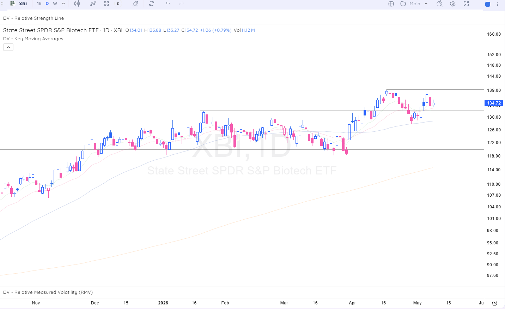](https://substackcdn.com/image/fetch/$s_!Cp8_!,f_auto,q_auto:good,fl_progressive:steep/https%3A%2F%2Fsubstack-post-media.s3.amazonaws.com%2Fpublic%2Fimages%2F3e4d4393-d49b-4fc5-9a8d-12a02546a4f9_1432x875.png)

**ARKK (Daily)**Okay hear me out…

[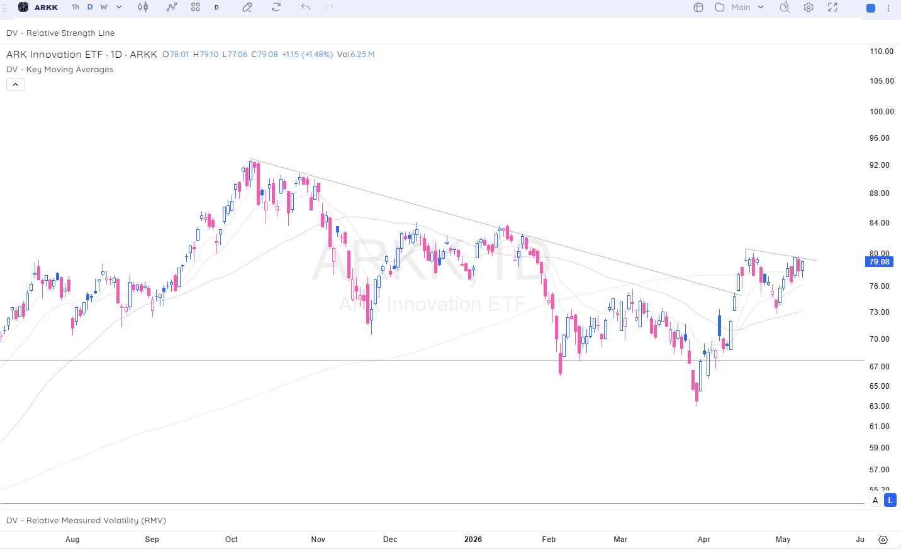](https://substackcdn.com/image/fetch/$s_!jMdT!,f_auto,q_auto:good,fl_progressive:steep/https%3A%2F%2Fsubstack-post-media.s3.amazonaws.com%2Fpublic%2Fimages%2F6c5dc517-004b-4d76-b5a4-0878dbca0261_1432x874.png)

**REMX (Daily)**Fake breakout and squat vibes here. Don’t lose sight.

[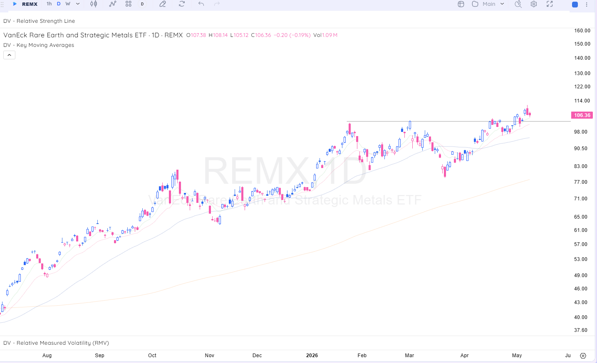](https://substackcdn.com/image/fetch/$s_!kNGx!,f_auto,q_auto:good,fl_progressive:steep/https%3A%2F%2Fsubstack-post-media.s3.amazonaws.com%2Fpublic%2Fimages%2F9dffc10a-2f9f-4f24-9b18-f6cc3c76ad42_1435x875.png)

**WGMI (Daily)**So many great looks in here from CIFR WULF CORZ IREN APLD RIOT HUT. And then the neoclouds as well of course with NBIS and CRWV. Don’t think these are done at all.

[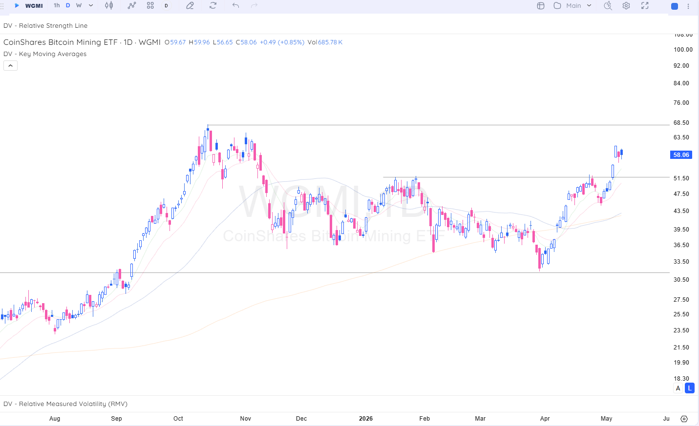](https://substackcdn.com/image/fetch/$s_!npUC!,f_auto,q_auto:good,fl_progressive:steep/https%3A%2F%2Fsubstack-post-media.s3.amazonaws.com%2Fpublic%2Fimages%2F073af449-6faa-494b-9dbd-ea61b28478b9_1431x874.png)

**USO (Daily)**Oil remains elevated and with CPI on Tuesday it will be interesting.

[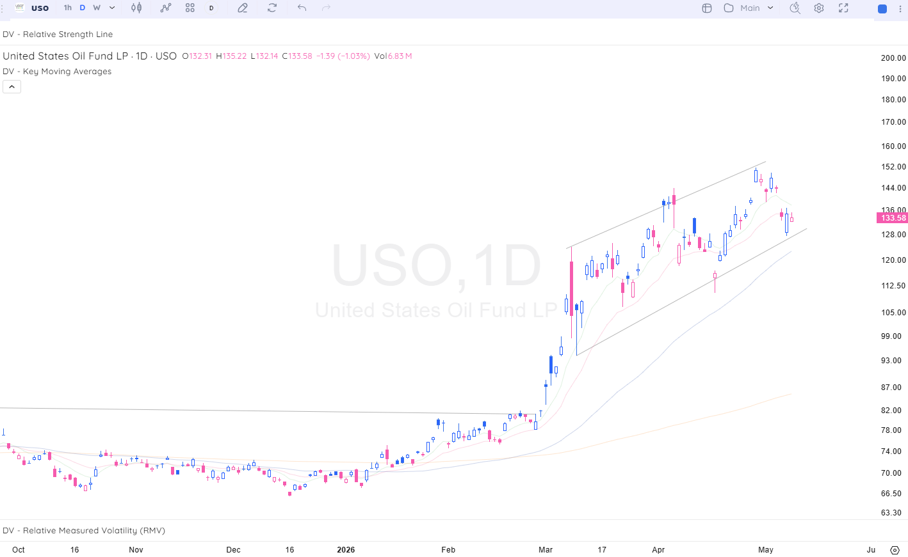](https://substackcdn.com/image/fetch/$s_!ev5e!,f_auto,q_auto:good,fl_progressive:steep/https%3A%2F%2Fsubstack-post-media.s3.amazonaws.com%2Fpublic%2Fimages%2F2398c575-b71b-4026-9a60-0066c55abf5b_1418x871.png)

**UFO (Daily)**Strong close on Friday on the back of RKLB’s 30% advance. Remains one of the most exciting groups in the market with a lot of viable setups like RKLB PL FLY LUNR BKSY and others.

[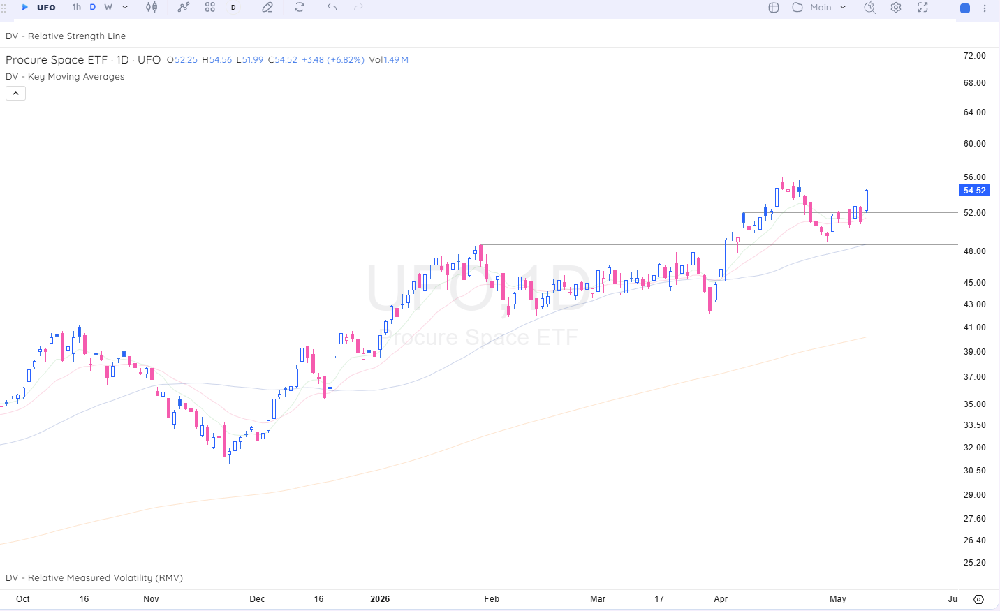](https://substackcdn.com/image/fetch/$s_!L6aL!,f_auto,q_auto:good,fl_progressive:steep/https%3A%2F%2Fsubstack-post-media.s3.amazonaws.com%2Fpublic%2Fimages%2F0180565c-2a23-4828-94ae-486b6f016c96_1432x875.png)

**HACK (Daily)**

[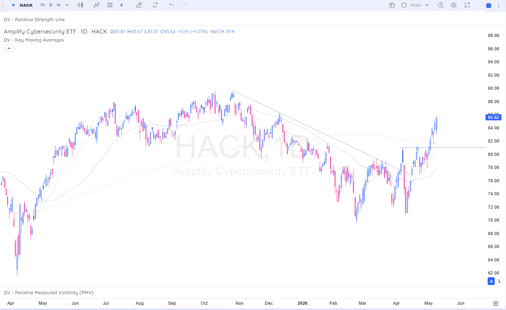](https://substackcdn.com/image/fetch/$s_!tJcF!,f_auto,q_auto:good,fl_progressive:steep/https%3A%2F%2Fsubstack-post-media.s3.amazonaws.com%2Fpublic%2Fimages%2Ffab6e3ca-ec3d-41b7-8ced-db49da46bf3e_1434x881.png)

**IGV (Daily)**Software has been very interesting during earnings season and I think there are some standouts. Possibly coming out of a base here and has seen some notable up down vs the Semis on certain days. Some of the lower weighted stocks that are making highs or coming out of bases or gapping up on earnings look significantly more attractive than the legacy software heavy weights.

[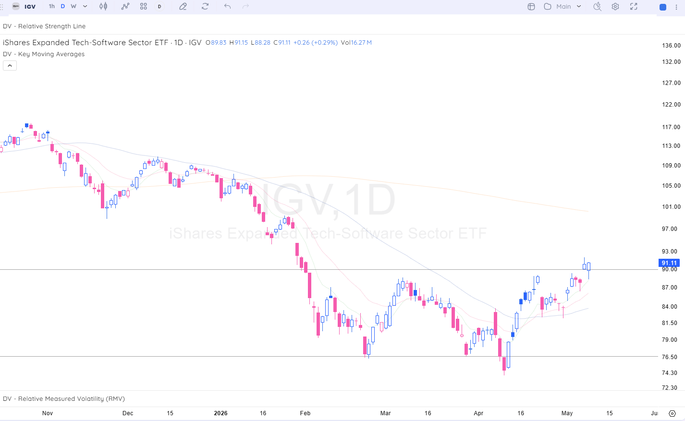](https://substackcdn.com/image/fetch/$s_!fA_c!,f_auto,q_auto:good,fl_progressive:steep/https%3A%2F%2Fsubstack-post-media.s3.amazonaws.com%2Fpublic%2Fimages%2F9ec3c1f7-2fb7-4f2d-a78d-3bd8ab1994e6_1426x877.png)

**BTC (Daily Chart)**

[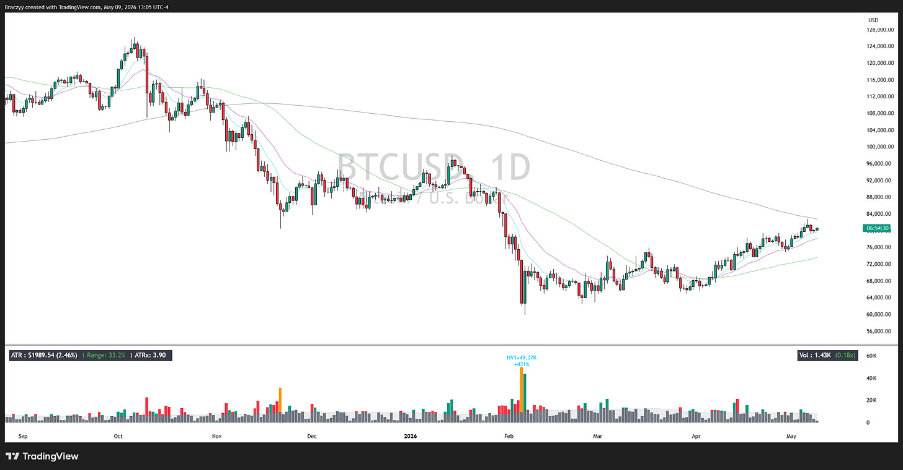](https://substackcdn.com/image/fetch/$s_!p4qF!,f_auto,q_auto:good,fl_progressive:steep/https%3A%2F%2Fsubstack-post-media.s3.amazonaws.com%2Fpublic%2Fimages%2Fc53668e5-1a36-4322-a9f1-dd50f0bf31bc_2454x1281.png)

---

## **Bracco’s Breakdown & Top Ideas**

---

Another absolutely insane week of price action, specifically in the QQQ and Semiconductors. I hate to be this guy and ruin the party, but some of these names are beginning to fill out my criteria for a parabolic short. Nobody really likes when I write about these in Sunday Scans, but have been pretty accurate so far this year with my write-ups on SLV GLD in January and KOSPI KORU in February. They are very tough trades and don’t need to be followed, but I also love to help someone riding a big unrealized long position take advantage and trim a bit into a parabolic extension.   
  
I have not traded any of the semiconductors to the short side yet on this recent rally as none of them really set-up, just pure strength. But as of Friday’s close a few names are starting to check the boxes, opening the window of opportunity for this week.   
  
Let’s first start with the QQQ. We are really starting to accelerate to the upside here, closing completely outside of the upper Bollinger Band after Friday’s 2.3% gain. The QQQ is now 9.91 ATR multiples above the 50-day moving average, its largest extension since inception in March of 1999. I am not looking for some massive top here, but it is hard to imagine that this does not result in a sharp pullback off the highs. Then again, I have seen more than a few historic moves this year that I would have never expected. Point is, if a few names set up for parabolic shorts, the QQQ extension helps support that thesis.

[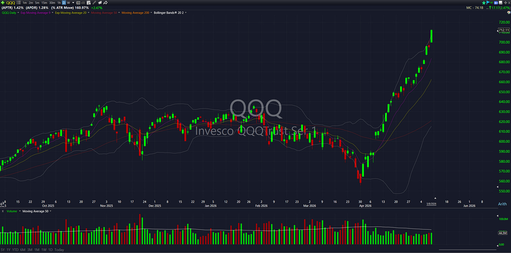](https://substackcdn.com/image/fetch/$s_!YyCA!,f_auto,q_auto:good,fl_progressive:steep/https%3A%2F%2Fsubstack-post-media.s3.amazonaws.com%2Fpublic%2Fimages%2F83896cdc-be04-469a-8b31-68a41e600b07_2556x1265.png)

---

The four names I will be watching closely this week are INTC SNDK MU. Below I have attached a spreadsheet of parabolic extensions I have tracked over the years. I studied their ATR multiples from 50MA the day before the peak as well as the % extension above specific moving averages. ATR multiples above the 50MA from Jeff Sun beat simple percent gains because they adjust for the stock’s unique volatility. That is what I like to focus on the most. Helps reveal true over-extensions in parabolic moves that just straight up percentages often mislead imo.  
  
Below the averages I attached the current statistics for the four names mentioned above. The green highlighted boxes = above the average in which all the names above peaked at. As you can see a few boxes have been checked, but not all there yet. If we do see continued FOMO and momentum in these names early this week, I imagine a few of them will be above average in every category = in play.

---

One characteristic that is extremely important when identifying a parabolic advance is consecutive weeks of range expansion. We recently saw this with Silver in January when it put together 3 consecutive weeks of range expansion before it’s climax, as well as many more classic, model book examples throughout the years.

Consecutive weeks of range expansion signal exponential price progression, a hallmark of parabolic curves. It is a week by week build up into a climactic reversal. The cherry on top is a signifigant range expansion week on the 3rd or 4th week of the burst, which is typically the final week of the move.  
  
Here are the last 3-weeks of percentage gains for **SNDK MU** & **INTC**:  
  
**SNDK**  
Week 1 (+7.48%)  
Week 2 (+19.91%)  
Week 3 (+31.62%)

**MU**  
Week 1 (+8.20%)  
Week 2 (+9.15%)  
Week 3 (+9.16%)  
Week 4 (+37.73%)

**INTC**   
Week 1 (+9.81%)  
Week 2 (+20.50%)  
Week 3 (+20.69%)  
Week 4 (+25.40%)

Textbook parabolic price progression over consecutive weeks on all three of them.

---

We also witnessed what felt like complete upside panic and FOMO in the leading semiconductors on Friday.   
  
One example being the news that hit at 1pm stating that Apple and Intel reached a preliminary chip-making agreement, which led to a near +13% gain in just 20 minutes... To put it into perspective, Intel’s market cap increased by the same amount of expected 2026 revenue in those 20 minutes…   
  
Just moments later, Trump said “Go buy a dell” which sent DELL flying +8% in 30 minutes…  
  
This is the type of price action and hype you see on the final stage of a parabolic burst. Not to mention the absurd volume of options being traded on these names as we approach May OPEX this Friday...

---

To clarify, the parabolic short is an extraordinarily high-probability mean reversion opportunity, that can sometimes lead to secular tops, but not always. I have no clue where these stocks will be a month or a year from now, but I know my setups when I see them.

---

## **TSDR’s Weekly Outlook & Watchlist**

---

**In the discord we offer live trading everyday, position updates, entry and exit alerts, watchlists, scanning, daily lessons, and active chat to ask questions about anything you need.**

**[Go to our website and check us out and use code “SUBSTACK” for 15% off forever!](http://whop.com/uncharted/uncharted)**

---

***Current Positions***

---

**TQQQ $37.55  
BE $167.5  
MU $417.5  
GLW $161.13  
FCEL $11.84 (added more Thursday)  
ARM $145.4  
PL $12.4  
CORZ $19.02**  
  
***(DELL CRCL ALB RKLB in robinhood)***

---

Trailing stops and holding winners is not always easy. So far it has been. I mean MU is straight vertical. It closed at weekly highs and I am up 81%, BE up 58%, ARM up 45%.

Some of these staples and foundations of my account over the past month have done a majority of the heavy lifting. Also the TQQQ position at literally the lows lol. Up 104% on these shares now.

Also, I have to mention FSLY which was quite painful post earnings. I was able to get rid of it but not until my 105% gainer turned into a 36% gain. I had a fantastic entry at $16.97 and I was looking for the stock and the company to perform for multiple quarters. It is very frustrating because DOCN and AKAM dominated. DOCN had its chances to get involved to and I wish I would have. Oh well. Is what it is. I knew what I wanted and what I was doing and I was comfortable with the risk given the potential of the group.

---

Overall I am somewhat frustrated, yet also extremely satisfied and proud. Many things I wish I would have done and many I wish I did not. Selling SNDK and missing a number of good stocks that I should have been in but that’s trading man. Its crazy how you can perform so well but still feel like you didn’t. In fact, I see that is quite that is quite the universal sentiment right now which is interesting. When a market is euphoric it can be difficult to see other stocks you may have wanted at some point just rip. That’s trading man!  
  
Looking forward, I want to be focused on PEG setups, ER Gappers, RS stocks pulling back, and potential emerging groups with quality setups. Same as always while remaining mindful of the NEED for basing. Got a feeling we should keep an eye on WEEKLY charts so we do not get shaken out or over zealous as well.  
  
Lastly, I cannot deny the “extension” near term. However, there is so much to look forward to. I think it is absolutely imperative to look past it with patience and stay solely focused on what is next vs what is now.

---

#### **Some great charts below that I am watching. I have a big list and removed half, there are so many others that look amazing. Will make a video for discord members going over exact plans.**

---

### **Charts Covered**

---

#### CRCL DDOG MRVL GLW COHR AAOI AEHR TWLO BE NBIS APLD CIFR VICR NOK FCEL NVTS USAR RKLB YSS INOD WYFI FIVN BLZE ATEN CORZ NAVN DOCN NVT ATI CRDO ARM AMKR RNG ALM BW DGXX

---

**Didn’t have time to type stuff for each stock. Have to go help my wife and do mother’s day stuff! I will send a video to the discord later this evening! There are still so many charts. So many that look attractive and could trigger any day.   
  
Really wanted to type more stuff but my wife deserves today. Love you all.**

---

**CRCL (Daily)**With the Clarity Act due to get headlines this week and earnings for CRCL on Monday and the chart setup I think this is a main priority for me. An ultimate launchpad here and something that could really accelerate on strength.

**DDOG (Daily)**

**MRVL (Daily)**

**GLW (Daily)**

**COHR (Daily)**

**AAOI (Daily)**

**AEHR (Daily)**

**TWLO (Daily)**

**BE (Daily)**

**NBIS (Daily)**

**APLD (Daily)**

**CIFR (Daily)**

**VICR (Daily)**

**NOK (Daily)**

**FCEL (Daily)**

**NVTS (Daily)**

**USAR (Daily)**

**RKLB (Daily)**

**YSS (Daily)**

**INOD (Daily)**

**WYFI (Daily)**

**FIVN (Daily)**

**BLZE (Daily)**

**ATEN (Daily)**

**CORZ (Weekly)**

**NAVN (Daily)**

**DOCN (Daily)**

**NVT (Daily)**

**ATI (Daily)**

**CRDO (Daily)**

**ARM (Daily)**

**AMKR (Daily)**

**RNG (Daily)**

**ALM (Daily)**

**BW(Daily)**

**DGXX (Daily)**

---

**THANK YOU FOR READING**  
  
*-Uncharted Territory*

[Join Discord with code SUBSTACK](https://whop.com/uncharted/uncharted/)

---

### **[LIVE TRADING ON ZOOM AT 9:15AM EST WITH BRACCO & TSDR EVERYDAY IN THE UNCHARTED TERRITORY DISCORD](http://whop.com/uncharted)**

---

###### `Disclaimer: The Uncharted Territory newsletter provides information for educational purposes only and is not financial advice. The authors are not financial advisors, and readers should consult professionals for personalized advice. Investing involves risks, and past performance is not indicative of future results. Readers are encouraged to conduct their own research before making investment decisions. The authors may hold positions not listed in The Uncharted Territory Newsletter. The Uncharted Territory Newsletter and its authors are not liable for any losses or damages resulting from the use of the provided information as all content is purely educational. This disclaimer is subject to change, and readers are responsible for reviewing the latest version.`